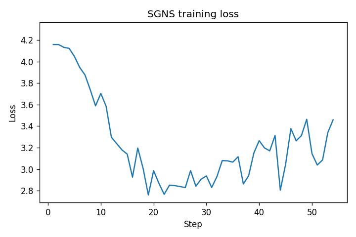
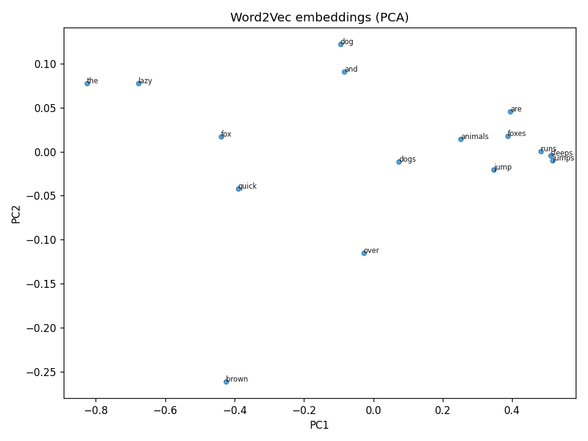
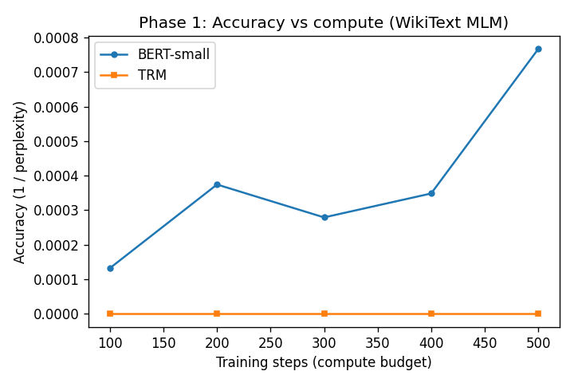
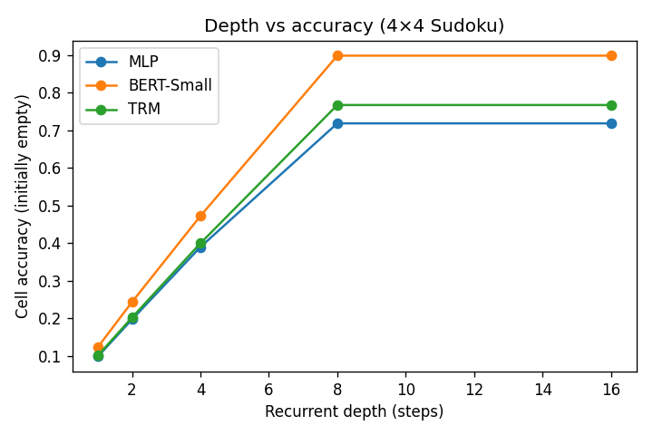

# Learning to Reason with Small Models

Study of how small and medium-size language models acquire reasoning capabilities under strict computational budgets, and how architectural choices affect the trade-off between accuracy and compute. Project for the JetBrains internship (Summer/Fall 2026).

**Phases (all implemented):**

1. **Task #1** — Word2vec from scratch in pure NumPy.
2. **Phase 1** — MLM pretraining: BERT-small vs TRM on WikiText; accuracy vs compute budget. See [mlm/README.md](mlm/README.md).
3. **Phase 2** — Recurrent reasoning on Sudoku: small model in a recurrent loop; depth vs accuracy. See [reasoning/README.md](reasoning/README.md).

**Full checklist:** [ROADMAP.md](ROADMAP.md)

---

## Repository layout

| Path | Description |
|------|-------------|
| **`word2vec/`** | **Task #1**: Skip-gram with negative sampling in pure NumPy. [word2vec/README.md](word2vec/README.md) |
| **`mlm/`** | **Phase 1**: MLM pretraining (BERT vs TRM), accuracy vs compute. [mlm/README.md](mlm/README.md) |
| **`reasoning/`** | **Phase 2**: Recurrent Sudoku, depth vs accuracy. [reasoning/README.md](reasoning/README.md) |
| **`ROADMAP.md`** | Detailed roadmap and status of every deliverable. |

---

## Task #1 — word2vec (implemented)

Task #1 asks for the **core word2vec training loop in pure NumPy** (no PyTorch/TensorFlow): forward pass, loss, gradients, and parameter updates for a standard variant such as skip-gram with negative sampling.

The solution in **`word2vec/`** implements **skip-gram with negative sampling (SGNS)** from scratch: forward scores, binary cross-entropy–style loss over positive and negative pairs, gradients for input and output embedding matrices, and explicit parameter updates (no autograd). Training uses a small demo corpus or any text file (e.g. text8). Optional evaluation and PCA visualisation of embeddings are included. The implementation is directly explainable for discussion on gradient derivation and alternatives (see [word2vec/GRADIENTS.md](word2vec/GRADIENTS.md)).

### Quick start (Task #1 — word2vec)

```bash
# From repo root
pip install -r requirements.txt
python -m word2vec.run
```

With **text8** (download once, then train):

```bash
python -m word2vec.download_text8
python -m word2vec.run --file word2vec/data/text8.txt --epochs 1 --min-count 5
```

Evaluation (similarity check, k-NN, analogies) runs at the end of `word2vec.run`. For **interpretable similarity and analogy results**, use a short run (e.g. `--epochs 1`) or the default demo corpus; long full-text8 runs can lead to collapsed embeddings (all similarities ≈ 1). See [word2vec/README.md](word2vec/README.md).

**Figures (loss curve + PCA of embeddings):**

```bash
pip install matplotlib   # optional
python -m word2vec.visualize --save_dir word2vec/figures
```

| Loss curve | Embeddings (PCA) |
|------------|------------------|
|  |  |

*Generated with demo corpus, 1 epoch. To regenerate: run the `visualize` command above.*

### Word2Vec — results and how to run

- **Train (demo):** `python -m word2vec.run`  
- **Train (text8, 1 epoch):** `python -m word2vec.run --file word2vec/data/text8.txt --epochs 1 --min-count 5`  
- **Figures:** `python -m word2vec.visualize --save_dir word2vec/figures`  
- **Tests:** `pytest word2vec/ -v` (or `python -m pytest word2vec/test_word2vec.py -v`)  
- **Gradient derivation:** [word2vec/GRADIENTS.md](word2vec/GRADIENTS.md)

---

## Phase 1 — MLM pretraining (accuracy vs compute)

BERT-small and TRM (Transformer Recurrent Model) are trained on **WikiText** with a **matched compute budget** (same training steps). Outcome: one plot of **accuracy (1/perplexity) vs compute (steps)** for both architectures.

### Quick start (Phase 1)

```bash
pip install -r mlm/requirements.txt
python -m mlm.run_compute_experiment --out_dir mlm/figures
```

**Output:** `mlm/figures/accuracy_vs_compute.png` — BERT vs TRM under the same compute. If the TRM curve appears near zero, see [TRM curve near zero](mlm/README.md#trm-curve-near-zero) in [mlm/README.md](mlm/README.md) for the explanation.

| Accuracy vs compute |
|---------------------|
|  |

*To regenerate: run the command above. See [mlm/README.md](mlm/README.md) for options (WikiText-103, more steps).*

---

## Phase 2 — Recurrent reasoning (Sudoku, depth vs accuracy)

**BERT-Small and TRM** are embedded in a **recurrent loop** on 4×4 Sudoku: at each step the model sees the current grid and predicts one cell update; state is passed to the next step. We vary the number of steps (depth) and measure accuracy; the default run compares MLP, BERT, and TRM.

### Quick start (Phase 2)

```bash
pip install torch  # or: pip install -r reasoning/requirements.txt
python -m reasoning.run_depth_experiment --out_dir reasoning/figures
```

**Output:** `reasoning/figures/depth_vs_accuracy.png` — accuracy vs number of recurrent steps (depth).

| Depth vs accuracy |
|-------------------|
|  |

*Interpretation: more recurrent steps (compute depth) improve reasoning accuracy under a fixed per-step cost (e.g. ~10% at depth 1 → ~73% at depth 8). To regenerate: run the command above.*

See [reasoning/README.md](reasoning/README.md) for design choices and reproduce steps.

---

## Word2Vec full-run results (text8, many epochs)

If you train on full text8 for many epochs (e.g. 5–10), the run completes correctly but **embeddings can collapse**: cosine similarity ~0.999 for all pairs, nearest neighbours all 1.0, analogy accuracy 0/4. The implementation and gradients are correct; the collapse is a training-dynamics effect (e.g. learning rate or overtraining). For **interpretable** similarity and analogy, use `--epochs 1` or the default demo corpus. The loss curve from `python -m word2vec.visualize` uses a longer demo and no subsampling so the plot shows a clear descending loss.

---

## Tests

From repo root:

```bash
pip install -r requirements.txt
pytest word2vec/ -v
```

Or with dev extras:

```bash
pip install -e ".[dev]"
pytest word2vec/ -v
```

Tests cover: sigmoid stability, shapes, initial loss, gradients vs finite difference, subsampling behaviour, and that training decreases loss.

---

## Lint and format

Install [Ruff](https://docs.astral.sh/ruff/), then:

```bash
ruff check . --fix
ruff format .
```

Config: `pyproject.toml` ([tool.ruff], [tool.ruff.lint], [tool.ruff.format]). Run these before submitting.

---

## Run everything (reproduce all figures)

```bash
pip install -r requirements.txt
python -m word2vec.visualize --save_dir word2vec/figures

pip install -r mlm/requirements.txt
python -m mlm.run_compute_experiment --out_dir mlm/figures

pip install torch numpy matplotlib
python -m reasoning.run_depth_experiment --out_dir reasoning/figures
```

---

## Requirements

- Python ≥ 3.8  
- **Task #1:** NumPy (see `requirements.txt`). Optional: `matplotlib`, `pytest`, `ruff`.  
- **Phase 1:** `mlm/requirements.txt` (torch, transformers, datasets).  
- **Phase 2:** `reasoning/requirements.txt` (torch, numpy, matplotlib).

---

## Approach and results

- **Task #1 (word2vec):** Skip-gram with negative sampling in pure NumPy: forward pass, loss, gradients, and parameter updates (no autograd). Subsampling, Adagrad, and LR decay follow Mikolov et al. Gradients are documented in [word2vec/GRADIENTS.md](word2vec/GRADIENTS.md). Result: trainable embeddings; loss decreases; similarity and analogies behave as expected on the demo corpus; full text8 can collapse without tuning.
- **Phase 1 (MLM):** BERT-small and TRM are trained on WikiText under a **matched compute budget** (same number of steps). Result: systematic **accuracy (1/perplexity) vs compute (steps)** comparison; BERT typically improves with steps; TRM can need extra tuning for comparable perplexity in this setup.
- **Phase 2 (reasoning):** BERT-like and TRM models are **embedded in a recurrent loop** on 4×4 Sudoku: state = current grid, passed between steps; at each step the model predicts one cell update. Result: **depth vs accuracy** curves (default run compares MLP, BERT-Small, TRM); more recurrent steps improve cell accuracy (e.g. ~10% at depth 1 → ~70–90% at depth 8 depending on model).

All phases are implemented and reproducible; see [ROADMAP.md](ROADMAP.md) for the full checklist.

---

## Mentors

**Kacper Ogorek**, **Denis Stepanov**
